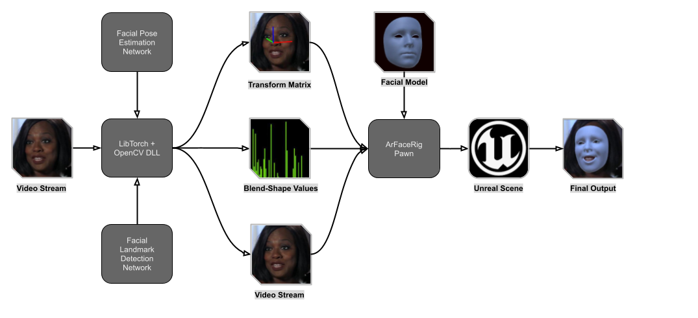

# Facial-Pose-Estimation-Unreal
This repository is a Unreal Plugin demonstrating realtime AR Facial Pose Estimation. This utilizes a plugin DLL from my [facial-pose-estimation-libtorch-dll](https://github.com/NeuralVFX/facial-pose-estimation-libtorch-dll) project and a custom trained Neural Net from my [facial-pose-estimation-pytorch-v2](https://github.com/NeuralVFX/facial-pose-estimation-pytorch-v2) project.

## About
This is one of three repositories which together form a larger project, these are the three repositories:
- [facial-pose-estimation-pytorch-v2](https://github.com/NeuralVFX/facial-pose-estimation-pytorch-v2)
- [facial-pose-estimation-libtorch-dll](https://github.com/NeuralVFX/facial-pose-estimation-libtorch-dll)
- [facial-pose-estimation-unreal](https://github.com/NeuralVFX/facial-pose-estimation-unreal) - You are here.

This blog post describes the whole project: [AR Facial Pose Estimation](http://neuralvfx.com/augmented-reality/ar-facial-pose-estimation/)

## Extra Info
- This runs live on a desktop
- Tracks both the transform of the entire head, and the pose of the face
- Tracks a single face at a time, if two people stand in front of the camera the face will jump back and forth
- There are controls built in for manually adjusting camera FOV
- The `Neural Net` used by the project can be found here: [facial-pose-estimation-pytorch](https://github.com/NeuralVFX/facial-pose-estimation-pytorch-v2)

## Estimation Pipeline Diagram

## Code Usage
Usage instructions found here: [user manual page](USAGE.md).

