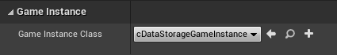
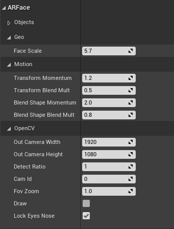

# Getting Started

## Requirements:
- Unreal Engine 4.26
- Visual Studio
- LibTorch 1.7 (GPU)

## Project Setup

#### New Project
- Make a C++ Unreal Project 
- Make sure you have a `Plugins` folder inside of the project

#### Compile
- Clone this Repo into the `Plugins` folder: `git clone https://github.com/NeuralVFX/facial-pose-estimation-unreal.git` (Or download the zip file and unzip there)
- Right-click your `.uproject` file and click `Generate Visual Studio Project Files`
- Build the project from Visual Studio, using `Build Solution`

#### DLLs
- Follow [directions](https://github.com/NeuralVFX/facial-pose-estimation-libtorch-dll) to compile `facial-pose-estimation-libtorch.dll` and place into the bin directory (ie:`Plugins/basic-unreal-libtorch-plugin/Bin/Win64/`)
- Copy `LibTorch and OpenCV DLLs` into the projects (not the plugin) `Binaries` folder (ie:`Binaries/Win64/`)

#### Models
- Download the `SSD`, `Landmark Detection`, `Facial Pose Estimation`, and `Blendshape Mixer` models and place into the same path you have designated in the DLL

| **Model**                    | **Link**                                  |
|------------------------------|--------------------------------------------|
| `Facial Pose Estimation Network`|[bs_detect.ptc](https://github.com/NeuralVFX/facial-pose-estimation-pytorch-v2/raw/main/output/bs_detect.ptc)|
| `Facial Blend Shape Mixer`|[bs_model.ptc](https://github.com/NeuralVFX/facial-pose-estimation-pytorch-v2/raw/main/output/bs_model.ptc)|
| `Face Detection SSD Meta`                   | [deploy.prototxt](https://github.com/spmallick/learnopencv/raw/master/FaceDetectionComparison/models/deploy.prototxt) |
| `Face Detection SSD Model`                  |    [res10_300x300_ssd_iter_140000_fp16.caffemodel](https://github.com/spmallick/learnopencv/raw/master/FaceDetectionComparison/models/res10_300x300_ssd_iter_140000_fp16.caffemodel)                                        |
| `Landmark Detection Model`     |      ** coming soon***|

#### Find Plugin
- Open the compiled project in Unreal Engine
- From `Edit->Plugins`, locate the `Other` Category
- Find `FacialPoseEstimation` and click `Enable`


#### Scene/World Setup

- To enable DLL, open `Settings->Project Settings` and find `GameInstanceClass`, replace this with `cDataStorageGameInstance`


- From the Content Manager, open the level `FacialPoseEstimation Content Assets->TestLevel`
- The `ArFaceRig_BP` is a Blueprint made from a Pawn, so in `World Settings`, double check that `GameMode Override` is set to `ArFaceRig_BP`, this has the Pawn set already.


## Run It

#### Run Test Scene

- Play the level!
- The ArFace should snap onto your face and follow your motion

# Plugin Contents

## Classes

#### ArFaceRig - Pawn Class
- Pawn class which runs AR facial pose estimation on live video stream
- Contains a camera, face model, and an image plane
- The camera position and fov, also the image plane placement are automated
- Each tick, this queries `UDataStorageGameInstance` and then updates the face position, blendshapes and the background image

#### cDataStoageWrapper - Object Class
- Wrapper for `facial-pose-estimation-libtorch.dll`
- Finds and initiates `DLL`
- Exposes functions of `DLL`

#### UDataStorageGameInstance - GameInstance Class
- This is a wrapper for `cDataStoageWrapper`
- Manages starting and stopping `OpenCV` and `Litorch` based on the game state
- Executes facial tracking pipeline, and passes data to `ArFaceRig`

## Content

#### ArFaceRig_BP - GameMode BluePrint
- A `Blueprint` based on `ArFaceRig` class

#### ArFaceGameMode_BP - GameMode BluePrint
- A `GameMode` which has the `Default Pawn Class` overrriden with `ArFaceRig_BP`

#### TestLevel - Level
- A simple level to run `ArFaceRig_BP` Pawn

## ArFaceRig Class Attributes



### Geo
```
--Face Scale, default=5.7, type=float                           # Scale override for face
```
### Motion
```
--TransformMomentum, default=1.2, type=float                    # Momentum scale for temporal blending on transform
--TransformBlendMult, default=.5, type=float                    # Multiplier for temporal blending on transform
--BlendShapeMomentum, default=1.2, type=float                   # Momentum scale for temporal blending on blendshapes
--BlendShapeBlendMult, default=.5, type=float                   # Multiplier for temporal blending on blendshapes
```
### OpenCV
```
--Out Camera Width, default=1920, type=int                      # Holds the resolution width which OpenCV attains when opening camera stream
--Out Camera Height, default=1080, type=int                     # Holds the resolution heigh which OpenCV attains when opening camera stream
--Detect Ratio, default=1, type=int                             # Amount to down-scale camera stream image before detectng face
--Cam Id, default=0, type=int                                   # Which camera to open with OpenCV
--Fov Zoom, default=1 type=float                                # FOV multiplier for both PnP solve and Unreal camera
--Draw, default=false, type=bool                                # Whether to draw OpenCV PnP solve indicators on background image
--Lock Eyes Nose, default=true, type=bool                       # Whether to lock the eye and nose points for the PnP solve
```
